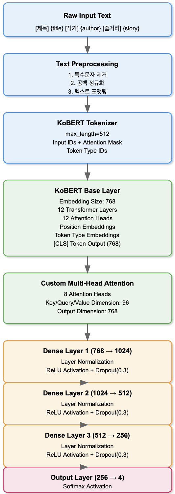

# 📚 도서 추천 시스템 (Book Recommendation System)

## 📋 목차
1. [프로젝트 개요](#1-프로젝트-개요)
2. [시스템 구성](#2-시스템-구성)
3. [설치 및 실행](#3-설치-및-실행)
4. [사용자 가이드](#4-사용자-가이드)
5. [기술 상세](#5-기술-상세)
6. [문제 해결](#6-문제-해결)
7. [향후 계획](#7-향후-계획)

## 1. 프로젝트 개요

### 🎯 소개
Google Colab 환경에서 실행되는 딥러닝 기반 개인화 도서 추천 시스템입니다. KoBERT를 활용하여 도서의 제목, 작가, 줄거리를 분석하고 사용자의 선호도를 학습하여 맞춤형 도서를 추천합니다.

### 🔗 링크
더욱 자세한 내용은 아래 노션 링크를 참고해주세요.   
[노션 링크](https://www.notion.so/Book-Recommendation-System-13be068e7bd38153a09acb2db855d661?pvs=4)

### ⭐ 주요 기능
* 개인별 도서 선호도 기반 추천
* 실시간 선호도 업데이트 및 반영
* 카테고리별 도서 분석과 통계
* 무한 스크롤 방식의 추천 목록
* 사용자 취향 분석 리포트

### 🛠️ 기술 스택

* **환경**: `Google Colab`
* **프론트엔드**: `JavaScript` `HTML`
* **백엔드**: `Flask`
* **DB**: `PostreSQL`
* **AI**: `PyTorch` `KoBERT`
* **인프라**: `AWS RDS` `ngrok`

## 2. 시스템 구성

### 📁 프로젝트 구조
하단의 링크에서 모델 파일 및 데이터 파일을 다운로드 받을 수 있습니다.   
[모델 및 데이터 다운로드](https://www.notion.so/Book-Recommendation-System-13be068e7bd38153a09acb2db855d661?pvs=4)
```
📦 BRS
┣ 📂 App
┃ ┣ 📂 imgs
┃ ┣ 📂 templates
┃ ┃ ┣ 📜 index.html
┃ ┃ ┣ 📜 select_books.html
┃ ┃ ┣ 📜 recommend_books.html
┃ ┃ ┗ 📜 error.html
┃ ┣ 📂 KoBERT (Notion 링크 참고)
┃ ┃ ┗ 📜 best_model.pt
┃ ┃ ┗ 📜 category_mapping.txt
┃ ┃ ┗ 📜 config.txt
┃ ┣ 📜 app.py
┃ ┣ 📜 .env
┣ 📂 BookData (Notion 링크 참고)
┃ ┣ 📜 MBRS_BOOK_CB_4
┃ ┣ 📜 MBRS_BOOK_CB_4_T
┃ ┣ 📜 MBRS_BOOK_CB_4_Test
┃ ┗ 📜 MBRS_BOOK_CB_4_V
┣ 📜 .gitignore
┗ 📜 README.md
```

### 🏗️ 시스템 아키텍처

#### 데이터베이스 레이어
* Amazon RDS PostgreSQL 데이터베이스 사용
* 주요 테이블:
  * `BOOK_CB_4`: 도서 기본 정보 (제목, 작가, 줄거리)
  * `user_preferences`: 사용자 도서 선호도 정보
  * `user_embeddings`: 사용자 취향 임베딩 벡터

#### 머신러닝 레이어

* KoBERT 기반 도서 텍스트 분석
* 개선된 아키텍처:
  * 멀티헤드 어텐션으로 텍스트 특성 강화
  * 4단계 계층적 분류기 (1024→512→256→출력)
  * Dropout과 LayerNorm으로 과적합 방지

## 3. 설치 및 실행

### 💻 사전 요구사항
* Google Colab (Colab Pro 권장)
* 충분한 Google Drive 저장공간
* PostgreSQL이 설치된 Amazon RDS
* ngrok 계정

### 🚀 실행 방법

1. Google Drive 마운트 및 패키지 설치
```python
from google.colab import drive
drive.mount('/content/drive')

!pip install python-dotenv pyngrok psycopg2-binary
```

2. 환경 설정
```python
# .env 파일 생성 (App 폴더)
DB_HOST=your_rds_endpoint
DB_NAME=your_database_name
DB_USER=your_username
DB_PASSWORD=your_password
DB_PORT=5432
```

3. ngrok 설정
```python
from pyngrok import ngrok
ngrok.set_auth_token("Your-Ngrok-Token")
```

4. 애플리케이션 실행
* `app.ipynb`의 "Final App" 셀 실행
* 생성된 ngrok URL로 접속

## 4. 사용자 가이드

### 📚 시작하기
1. 시스템 접속
   * 제공된 URL 접속
   * 닉네임 입력 또는 기존 기록 확인

2. 도서 추천 받기
   * 최소 4권 이상의 선호 도서 선택
   * 다양한 카테고리 선택 권장
   * 3-4분간 도서 분석 진행
   * 추천 목록 확인 및 선호도 표시

### 📊 개인 취향 분석
* 카테고리 분포 확인
* 선호/비선호 카테고리 분석

## 5. 기술 상세

### 🔌 API 엔드포인트
* `GET /`: 메인 페이지
* `POST /select_books`: 도서 선택
* `POST /recommend_books`: 추천 처리
* `POST /update_preference`: 선호도 업데이트
* `GET /load_more_books`: 추가 도서 로드
* `GET /get_user_analysis`: 사용자 분석

### 🔍 추천 알고리즘
* KoBERT 기반 텍스트 분석
* 멀티헤드 어텐션 메커니즘
* 실시간 선호도 학습 및 반영

## 6. 문제 해결

### ⚠️ 일반적인 문제
* 추천 품질 저하: 더 많은 도서 평가 필요
* 런타임 연결 끊김: GPU 설정 확인 (L4, A100 권장 / ⚠️T4 이용 시 MBRS_BOOK_CB_4_T 사용)
* 메모리 부족: 런타임 재시작
* 템플릿 로드 실패: 경로 확인

### 🔄 Colab 관련 주의사항
* 12시간 런타임 제한
* 주기적 재연결 필요
* GPU 메모리 제한

## 7. 향후 계획

### 🔮 개선 방향
* 카테고리 추가
* 협업 필터링 통합
* 실시간 처리 최적화
* 추천 설명 기능
* 독립 서버 환경 구축